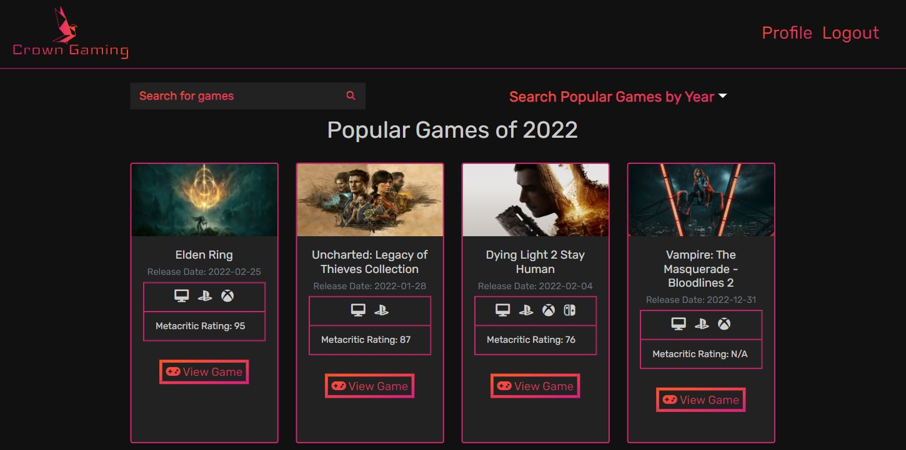

# Crown-Gaming

## Links
* Repository Link: [Crown-Gaming](https://github.com/ryanweiler92/Crown-Gaming)
* Application Link: [Crown-Gaming](https://crown-gaming.herokuapp.com/)
* For any additional questions please reach out to ryanweiler92@gmail.com

## Description
The Crown Gaming application provides users the ability to search and save video games to their profile. A user can designate a saved game to their
favorite games list or their wishlist. The application provides helpful details on every game including screenshots, parent platforms, store availability,
playtime and more.

## Table of Contents
* [Installation](#installation)
* [Usage](#usage)
* [Contributors](#contributors)
* [Tests](#tests)
* [License](#license)

## Installation
No installation is required. 

## Usage

## Contributors

* [Ryan-Weiler](https://github.com/ryanweiler92)

## License
